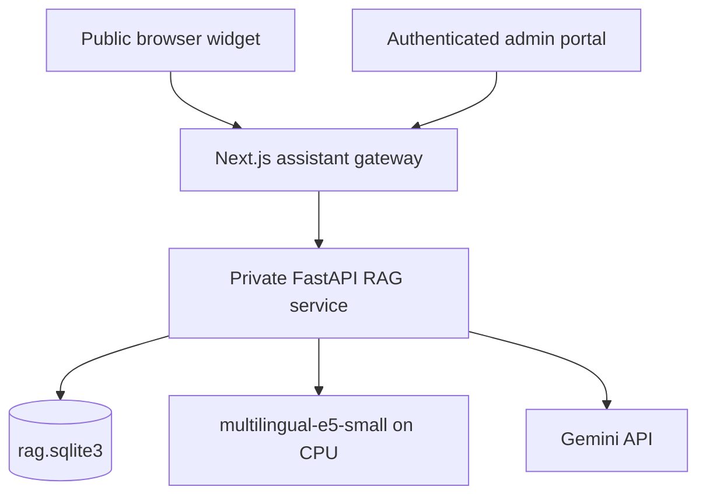

# Beka Legal Information Assistant — implementation guide

## Architecture



The widget runs in the browser, but all trust-bearing work stays on the server. The Next.js
gateway owns public rate limits and CMS identity. FastAPI owns parsing, chunking, embeddings,
retrieval, grounding, and generation. The two SQLite databases are deliberately separate:
`data/beka.db` belongs to Node and `rag-service/data/rag.sqlite3` belongs to Python.

## Repository map

```text
app/[locale]/layout.tsx
  mounts components/assistant/LegalAssistant.tsx

app/api/assistant/
  route.ts                    public rate-limited SSE gateway
  feedback/route.ts           privacy-preserving response rating

app/admin/assistant/page.tsx
components/admin/AssistantSources.tsx
app/api/admin/assistant/
  sources/route.ts            list and upload
  sources/[sourceId]/route.ts approve, reject, remove
  sources/[sourceId]/reindex/route.ts
  sync-site/route.ts

lib/assistant/
  server.ts                   private service client and secret header
  site-corpus.ts              published English website exporter
  types.ts                    shared browser/server contracts

rag-service/app/
  config.py database.py schemas.py security.py container.py main.py
  api/assistant.py api/admin.py api/health.py
  services/parser.py chunker.py embedder.py retriever.py ingestion.py llm.py
```

## End-to-end request sequence

1. The visitor opens **Ask Beka**; it never opens automatically.
2. The client creates a random local session identifier and posts the message, locale, and at
   most six short history turns to `/api/assistant`.
3. Next.js validates size and shape, then applies independent IP and session fixed-window limits.
4. FastAPI encodes `query: <question>` with the same E5 model used for `passage: <chunk>`.
5. The retriever loads only `publication_status='approved' AND deleted_at IS NULL`, executes an
   exact NumPy matrix dot product, applies the score threshold, and caps repeated chunks per source.
6. Gemini receives the approved chunks under a rigid public-information/not-legal-advice prompt.
7. The service streams `metadata`, `token`, `citation`, `done`, or `error` SSE events.
8. Citations are emitted from retrieval metadata, not invented by the model.
9. Telemetry stores a keyed session hash, locale, source IDs, outcome, and latency—never the raw question.

## Deployment gates

- Obtain written approval for the revised public-facing scope before release.
- Complete lawyer review of every launch source and every visible disclaimer/refusal flow.
- Configure a long `AUTH_SECRET` and a separate long `RAG_INTERNAL_API_KEY`.
- Bind FastAPI to loopback or a private container network; expose only Next.js.
- Persist and back up both SQLite directories on the same host.
- Configure the canonical production origin and explicit citation-host allowlist.
- Load-test exact retrieval with the real corpus and review the minimum-score threshold.
- Test English, Amharic, and Afaan Oromo grounding, refusals, citations, keyboard use, mobile layout,
  screen-reader announcements, rate limits, timeout behavior, and prompt-injection attempts.
